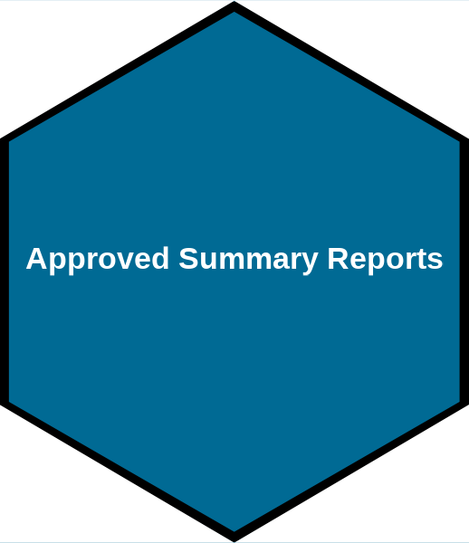

Click on a hexagon to go to the desired location. Hover over each hexagon for more information.

```{r setup, include=FALSE}
source('_setup.R')
# knitr::clean_cache(TRUE)
htmltools::tagList(
  xaringanExtra::use_clipboard(
    button_text = "<i class=\"fa fa-clipboard\"></i>",
    success_text = "<i class=\"fa fa-check\" style=\"color: #37abc8\"></i>",
  ),
  rmarkdown::html_dependency_font_awesome()
)
# xaringanExtra::use_scribble()

cols <- c('#777777','#d66666','#f0f518','#2eb8dd','#6a8868')
```


<span class="br2"></span>

<center>
<a href ="table.html"></a>
<a href ="summary.html"></a>
</img></center>

<center>
<a href ="https://github.com/j-harbin/dataSPA/"></a>
<a href ="https://orcid.org/0000-0003-3774-3732"></a>
</img></center>

<span class="br2"></span>

<center><i>Jaimie Harbin, Catalina Gomez, Remi Daigle, Jeff Jackson & Tana Worcester</i></center>

<span class="br2"></span>

<center>
</img>
</center>
