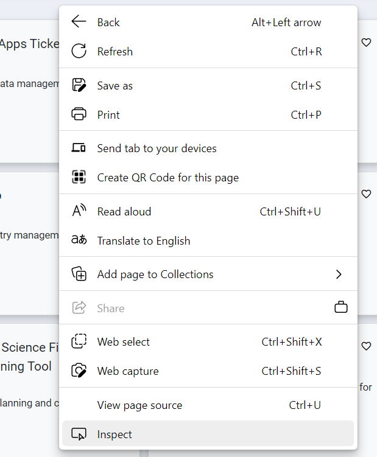
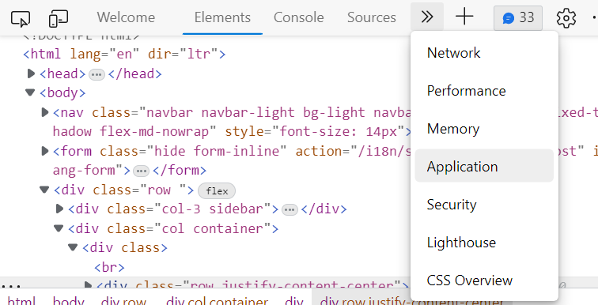
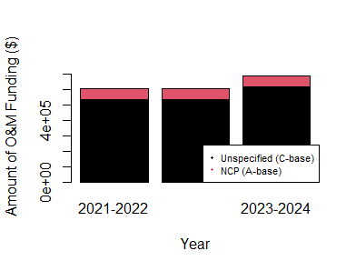

---
output:
  html_document: 
    fig_caption: yes
  pdf_document: 
    fig_caption: yes
---
# dataSPA Package:A Package for Obtaining Data for DFO Strategic Planning
## Jaimie Harbin

The `dataSPA` package is intended to be used by Department Of Fisheries and Oceans Canada (DFO) employees to obtain data from A) the Project Planning Tool (PPT) API and B) Salary Spread sheets to plot information related to allocation of funding.

Some disclaimers/ assumptions with this package include:

1. For this package to work, you must be on the DFO VPN
2. This code assumes some employees have not changed positions over the course of their career
3. As of 2023/05/23, in some cases when a employment classification is not provided, it us assumed the employee was a PC-2.
4. The salary calculations are based off of medians of federal employee pay scales for the year of the projects fiscal year, not the exact salary of individuals. If the pay information for a specific year is not available, the closest year is found.
5. Calculated over time salary does not consider the fact
sometimes overtime may be 1.5X or 2X regular salary
6. When a person with job classification EX is associated with a
project, they are not included in total weeks or salary.


To install the package, you must first be a collaborator of the private repository `dataSPA` hosted by `j-harbin` (Jaimie Harbin). Once you have been granted access, run the following code to install the package:

```{r, eval=FALSE}
# configure github and generate token
usethis::use_git_config(user.name = "YourName", user.email = "your@mail.com")
usethis::create_github_token() 

# paste your personal access token into pop-up that follows...
credentials::set_github_pat()

install.packages("devtools") # optional
devtools::install_github("j-harbin/dataSPA")
library(dataSPA)
```

Once the package is installed, the user should follow the following workflow to successfully use the package:


```{r fig1,fig.width=8.5,fig.height=3,fig.cap="\\label{fig:fig1}Figure 1: Work flow for the `dataSPA` package",echo=FALSE}
DiagrammeR::grViz("digraph flowchart {
      node [fontname = Helvetica, shape = rectangle]
      tab1 [label = '@@1']
      tab2 [label = '@@2']

      # edge definitions with the node IDs
      tab1 -> tab2;
      }

      [1]: 'getData()'
      [2]: 'createReport()'
      ")
```

## getData()

If `type` is `om`, this function extracts data from the om-costs project planning tool (PPT) API (http://dmapps/api/ppt/om-costs/) and combines it with the fiscal year from the project_years API (http://dmapps/api/ppt/). If `type` is `salary`, this function obtains the data from the staff API (http://dmapps/api/ppt/staff/) and combines it with information from a Human Resources (HR) spreadsheet.

It should be noted that this function will only work for authorized Department of Fisheries and Oceans Canada (DFO) employees. As shown in the help documentation for this function (`?getData`), a `cookie` is required. A `cookie` can be obtained by DFO staff by following the steps outlined below:

**1. Sign into DMApps on the internet**

**2. Right click in DMApps and click "Inspect Panel".**



**3. Click the >> arrows next to "Welcome", "Elements", "Console", and "Sources" to locate and click on "Application"**



**4. Under "Cookies", click on "http://dmapps" to find your csrftoken and sessionid and copy their value**

**5. Assign a variable in R with the following format:**

```
cookie <- "csrftoken=YOURTOKEN; sessionid=YOURSESSIONID"
```
This variable `cookie` will then act as your `cookie` argument in the `getData()` function, e.g.:

```{r, eval=FALSE}
data(salaries)
om <- getData(type="om", cookie=cookie)
salary <- getData(type="salary", cookie=cookie, salaries=salaries)

```

## plotSPA()

This function plots specific graphs (determined by the which argument) using the data frames returned by `getData()`. It is used in the `createReport()` function.

The various plot types are as follows:

* For `which="omBar"`, a bar graph representing amount of money ($) coded by funding type.

* For `which="omPie"`, a pie chart representing amount of money ($) coded by funding type

* For `which="omAllocation"` a bar graph representing amount of money ($)

*  For `which=omAllocationGeneral` a pie chat representing proportion of
#' funding per category type is plotted for year each of the specified project

* For `which="salaryBar"` a bar graph representing amount of salary money ($) using the median values of a specific job classification. Graph color coded by funding type indicated by the legend.

* For `which="salaryAllocation"` a bar graph representing amount of salary money ($) using the median values of a specific job classification.

* For `which="weekAllocation"` a bar graph representing time (weeks)

* For `which="indeterminate"` a pie chart representing proportion of indeterminate vs non-Indeterminate employees for project years is plotted

* For `which="predictSummary"`a line chart showing the trends for changes in different funding scenarios

* For `which="predict"` a bar chart showing the trends for changes in different funding scenarios is plotted with the number of stations overlying the figure with a line. A new plot is plotted for each funding scenario. If `endDate` is provided, the bar chart will represent funding as status quo until the end date (See example 3)

* For `which="predictSalary` a bar chat showing the trends of salary increasing while funding amount remains the same

To plot the amount of money invested in O&M per funding type for the Snow crab project, for example, the code is as follows:

```{r, eval=FALSE}
plotSPA(om, which="omBar", id=1093)
```



# createReport()

This function creates a fact sheet report for a specified project id. Example code is shown below:

```{r, eval=FALSE}
createReport(om=om, salary=salary, id=1093)
```


